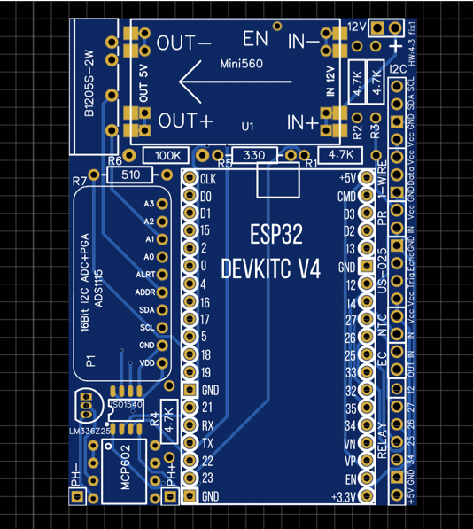

# WEGABOX

Web Electronic Garden Automatic on ESP32.

Телеграмм канал проекта [WEGABOX](https://t.me/esp32wega)

Содержание 
=================
<!--ts-->
* [Что такое WEGABOX](#what_is_wegabox)
* [Минимальные требования и знания](#what_to_know)
* [PCB плата WEGABOX](#pbc)
* [Распиновка jack разъемов для датчиков](#jack)
* [Компоненты для заказа](#what_to_buy)
    * [Лист компонентов](#wish_list)
* [Скачать проект WEGABOX](#wegabox_download)
* [Установка Visual Studio Code (vscode) и прошивка](#install)
* [Где искать помощь](#help)

<!--te-->

---
И так, что же такое **WEGABOX** 

**WEGABOX** это система контроля и мониторинга состояния гидропонной системы, куда входят следущие возможности
* Мониторинг `ЕС`
* Мониторинг `pH`
* Мониторинг `Температуры воздуха и раствора`(в баке и в корневой зоне)
* Мониторинг `Влажности воздуха`
* Мониторинг `Атмосферное давление`
* Мониторинг `СО2`
* Мониторинг `Освещенности`
* Мониторинг `Уровня раствора`
* Управление корневым давление(на сколько это возможно)
* Контроль `ЕС` в рабочем баке(в разработке, дата релиза не известна)

Важно: **WEGABOX** не имеет смысла без [WEGA](https://github.com/WEGA-project/WEGA/wiki) части.

Так же **WEGABOX** является важным звеном в [WEGA ecosystem](https://github.com/WEGA-project/WEGA-Mixer/blob/main/img/wega-ecosystem.jpg)

---
## Минимальные требования и знания 

Для того, чтобы собрать этот миксер необходимо:

- Минимальные знания в электронике (знать что такое `+` или `GND`)
- Умение читать схему, да-да, именно читать, а не разглядывать и смотреть
- Знание, что такое паяльник и как с ним работать
- Понимание как соединить три проводка в одной точке
- Умение собирать компоненты по схеме
- Знать и уметь, как прошивать ардуину и вообще знать, что это такое
- Минимальные знания в программировании. Мы попытались минимизировать необходимость ковыряние в коде, но все же придется изменять некоторые значения, о которых речь пойдет ниже

Если, всего выше перечисленного или одного из выше перечисленного не знаешь, не умеешь, не понимаешь, найди человека, который соберет этот миксер за тебя.

---
## PCB плата WEGABOX 

Для простоты сборки `WEGABOX` была разработана PCB плата, которую можно заказать и собрать самостоятельно.

[PCB WEGABOX](https://oshwlab.com/siv237/esp32wega4-2_copy)

Плату можно заказать через `https://www.allpcb.com/` или любой другой сайт, на ваш вкус.

### Внешний вид платы

### Распиновка Jack для датчиков 

---
## Компоненты для заказа 
 1. Плата контроллера [ESP32-WROOM-32D или ESP32-WROOM-32U](https://www.aliexpress.com/wholesale?&SearchText=ESP32-WROOM-32D+ESP32-WROOM-32U+)
 1. Датчик температуры и влажности [ATH10](https://aliexpress.ru/wholesale?SearchText=AHT10). [Пример позиции](https://aliexpress.ru/item/4000961263862.html)
 1. Фоторезистор [GL5528](https://aliexpress.ru/wholesale?SearchText=GL5528) для измерения света. [Пример позиции](https://aliexpress.ru/item/1125719348.html)
 1. Датчик расстояния для измерения уровня [US-025](https://www.aliexpress.com/wholesale?&SearchText=Ultrasonic+Ranging+Module+US-025)
 1. Стабилизатор для питания контроллера [mini560 5V](https://aliexpress.ru/wholesale?&SearchText=mini560+step+down+5V)
 1. Терморезистор 100кОм для компенсации ЕС [NTC-MF52-100K](https://www.aliexpress.com/wholesale?&SearchText=Thermistor+Resistor+NTC-MF52-100K). [Пример позиции](https://aliexpress.ru/item/32865194243.html)
 1. Водонепроницаемый [ds18b20](https://www.aliexpress.com/wholesale?&SearchText=ds18b20+waterproof) датчик температуры корней. [Пример позиции](https://aliexpress.ru/item/32832225749.html)
 1. Набор резисторов [Resistor Assorted Kit Set 10 -1M ](https://www.aliexpress.com/wholesale?&SearchText=Resistor+Assorted+Kit+Set+10+-1M+). [Пример позиции](https://www.aliexpress.com/item/1005002275520555.html)
 1. Провода ...

 ### Лист проверенных компонентов для заказа 
 Здесь вы найдете лист компонентов, которые уже заказывались ни раз, но смотрите на цены, они иногда сильно меняются.

[Лист компонентов](https://my.aliexpress.com/wishlist/shared.htm?groupId=1000000009461501)
---
## Скачать проект WEGABOX 
Скачать проект можно несколькими путями, самый просто это скачать архив текущего [репозитория](https://github.com/WEGA-project/wegabox/archive/refs/heads/main.zip) или со страницы [релизов](https://github.com/WEGA-project/wegabox/releases). Последний стабильный релиз можно найти [здесь](https://github.com/WEGA-project/WEGA-Mixer/releases).

Нажимаем на `Source code(zip)` выбранного релиза, скачиваем. Распаковываем архив в удобное место на диске.

Важно, что бы в путях до проекта не было пробелов и русских названий.

Например так будет работать `D:\wegabox`

Так не будет работать `D:\Вега бокс\wegabox`

---

## Установка Visual Studio Code (vscode) и прошивка 
### Шаг 1
Скачать и установить [vscode](https://code.visualstudio.com/download)

Если у вас `Windows OS`, то скорее всего потребуется установить драйвера, которые можно скачать [здесь](https://www.silabs.com/developers/usb-to-uart-bridge-vcp-drivers)

В большинстве случаев подходят [CP210x Universal Windows Driver](https://www.silabs.com/documents/public/software/CP210x_Universal_Windows_Driver.zip)

### Шаг 2
Запускаем `vscode`  идем в `extensions` и устанавливаем `platformio`.

### Шаг 3

Открываем папку с проектом.

### Шаг 4
Копируем файл `src/pre.h.rename` вставляем в ту же папку и переименовываем новый файл в `pre.h`.

Открываем  `pre.h`.

- Обновляем `ssid` - имя вашей сети 
- Обновляем `password` - пароль для вашего WiFi
- Обновляем `String wegaapi` - URL для подключения к `WEGA-API`
- Обновляем `String wegaauth` - token для подключения к `WEGA-API`
- Обновляем `String wegadb` - имя базы данных для хранения данных с `WEGABOX`
- Обновляем `long freqdb` - частота отправки данных в базу в секундах
- Обновляем `#define HOSTNAME` - Имя системы и DDNS .local

**Обновляем список датчиков, которые подключены к `WEGABOX`**
- 1 значит датчик включен(подключен)
* 0 значит датчик выключен(не подключен)
- Пример `#define c_DS18B20 1` - Цифровой датчик температуры для шины 1-Wire

**Что дальше**
- Сохраняем код
- Нажимаем `build`, что бы проверить что прошивка собирается

Если все хорошо, то в терминале будет что-то подобное.

Если в терминале видим `SUCCESS` то подключаем `ESP32` через консольный кабель.

Нажимаем кнопку  `Upload` и заливаем проект на `ESP32`

В большинстве случаев `platformio` найдет подключеное устроиство через консольный кабель автоматически, если этого не произошло то добавляем строчку в самом низу в файле `platformio.ini` 

Для `Widows OS` систем
`upload_port = COM[13]` -  после прошивки `ESP` по консольному кабелю строчку необходимо удалить.

Для `Linux` и `MacOS` систем
`upload_port = /dev/ttyUSB*` -  после прошивки `ESP` по консольному кабелю строчку необходимо удалить.

Больше про настройки `upload_port` можно прочитать [здесь](https://docs.platformio.org/en/latest/projectconf/section_env_upload.html#id1)

При условии, что сборка компонентов была выполнена правильно, то как только прошивка будет загружена на плату и произойдет перезагрузка на плате поднимется веб сервер. Вам необходимо найти `IP` адрес, который получил  `WEGABOX`. Это возможно сделать через веб интерфей роутера.

---
## Прошивка по Wi-Fi
В дальнейшем, если будет желание или необходимость перепрошивки `ESP` это можно будет сделать через Wi-Fi.

Для этого нужно будет раскоментировать строчку в `platformio.ini` и указать свой `IP` адрес  `WEGABOX`.

---
## Где искать помощь 

Если у вас все еще есть вопросы по настройке, заливке и гонфигурированни `WEGABOX`, 
то их всегда можно задать в официальном телеграмм канале [WEGABOX](https://t.me/esp32wega)

**!!! ВАЖНО !!!**

Ответы на вопросы, а что такое плюс или GND, а как быть с проводами и так далее в телеграмм канале дававться не будут.

Смотри [Минимальные требования и знания](#what_to_know)
